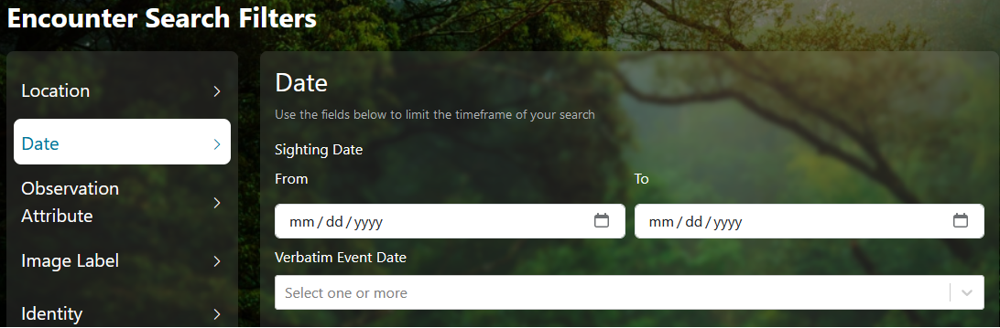

# Copy Contribution Guide

We have specific standards for copy in the interface. These standards are more strictly adhered to in new react pages, but jsp pages should move towards these standard when edited.

- Headers and field labels are title case. Descriptions and field placeholders are sentence case. 
- If a description is relevant to the component (ex: the dropdown is multi-select) rather than the specific field (ex: the search field looks through multiple database fields), incorporate the description into the component.
- If a description is 1-2 sentences, do not finish with punctuation. If a description is longer than 2 sentences, finish with punctuation. Treat as a block in the UI.
- Be mindful of character encoding.

## Terminology
We have learned that some terms are more intuitive than others and are working to update throughout the interface. The following list provides explanations of the terms used and any potential synonyms that may need to be adjusted.

- Encounter: one animal at a specific time and location. This is the base object of the platform.
- Sighting: one or more animals at a specific time and location. The object is made of one or more encounters linked together by a common time and place. _Potential synonyms: Occurrence_
- Individual: one animal that is known and named. The object is made of one or more encounters linked together by a common understanding of identity. _Potential synonyms: Marked Individual_
- Annotation: a box around the animal in the image. This is used during the matching process to avoid matching based off the background of the image.
- MediaAsset: general term for images or videos that have been uploaded to the system. _Potential synonyms: photographs, fotography, video_
- Location ID: location pulled from a user-defined list, used to filter data for algorithmic matching and for search. _Potential synonyms: locationID, region, study site_

## Internationalization
Currently, Wildbook supports 5 languages: English, French, German, Italian, and Spanish. Any new copy should be internationalized rather than added directly to the page.
- Good examples: `/src/main/webapp/index.jsp`, `/frontend/src/pages/EncounterSearch.jsx`
- Needs update: `/src/main/webapp/overview.jsp`

To add copy for a react page:
1. Navigate to `/frontend/src/locale`
2. In each of the `.json` files, add the same reference tag.
    - Try to group tags by page
    - If using a common component, check to see if an existing label works for your field. Only use the same field if the context is the same (ex: all Location ID dropdowns can use the same field label).
3. Provide translated copy for the reference tag in each language file.

To add copy for a jsp page:
1. Navigate to `/src/main/resources/bundles`
2. In each of the locale folders, find the appropriate `.properties` file, add the same reference tag.
3. Provide translated copy for the reference tag in each language file.