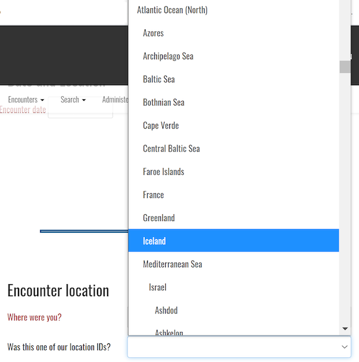

# Location IDs

A location ID in Wildbook is a fixed value that represents a specific area where wildlife data is collected. A location ID is one of Wildbook's three "where" data fields, which also include the more exact GPS coordinates (exact positioning) and the less exact verbatim locality (simply called "location").

Location IDs defined in Wildbook can be used to search and filter data, define location-specific permissions, and filter computer vision matching to only likely or realistic resighting locations.


## Reporting an Encounter with a Location ID

When you [report an Encounter](report-encounter.md), you can set its **location ID** directly. **Location IDs** are hierarchical and nested, allowing for regional organization.



[You can start a manual match from the Encounter](matching-process.md#manually-starting-a-match), which allows you to multi-select location IDs to match an Annotation against, as shown below.


## Adding a Location ID

To add a new Location ID, you'll need to contact your Wildbook's administrator, [create a PR](../contribute/pr-workflow.md) from your Wildbook's branch, or make the request at the [Wildbook Community](https://community.wildme.org).

**Location IDs** are added to a file in Wildbook named `locationID.json`.

* **name** - the descriptive, human-readable name of the location ID as you want it to display in the interface and in bulk import.
* **id** - the value of the location ID to store in the "ENCOUNTER" table of the Wildbook database in the `"LOCATIONID"` column. This value must be unique in `locationID.json`, but does not have to match the `name`.
* **locationID** - a `JSON` array of other location IDs that are nested under the current location ID (i.e., seas in an ocean, countries in a continent, etc).
* **prefix**(optional) - an abbreviation to the Location ID that can optionally be used to name new individuals when an incremental naming system is desired (e.g., Ice-0001, Ice-0002, etc.)
* **prefixDigitPadding** (optional) - the number of orders of magnitude that you expect with the incremental individual naming system. By default, the padding is set to 3 (Ice-001, Ice-002, etc.). For instance, setting `"prefixDigitPadding": 5` results in individual names such as Ice-00001, Ice-00002, etc.
* **defaultLatitude** (optional) - if there are no explicitly designated GPS coordinates for a particular encounter, the locationID can be used to designate a default latitude when exporting encounter search results using the "Exported Excel spreadsheet (.xls) file in OBIS format with locale inclusion for unreported GPS" option.
* **defaultLongitude** (optional) - if there are no explicitly designated GPS coordinates for a particular encounter, the locationID can be used to designate a default longitude when exporting encounter search results using the "Exported Excel spreadsheet (.xls) file in OBIS format with locale inclusion for unreported GPS" option.

Each location ID is defined in the **JSON** format as follows:

```
{ 
    "name":"Iceland", 
    "id":"Iceland", 
    "locationID":[], 
    "prefix": "Ice-", 
    "prefixDigitPadding": 4, 
    "defaultLatitude": 64.4577778110883, 
    "defaultLongitude": -22.454850367706463 
},
{
  "name":"South Pacific",
  "id":"South Pacific",
  "locationID":[ 
    {
      "name": "Tasman Sea", 
      "id": "Tasman Sea",
      "locationID": []
    }, 
    { 
      "name":"NewZealand", 
      "id":"NewZealand", 
      "locationID":[] 
    } 
  ],
  "prefix": "SP-"
}
```

Restart Tomcat after making changes.

### Example locationID.json

[Here is an example locationID.json file.](../assets/locationID_template.json)
