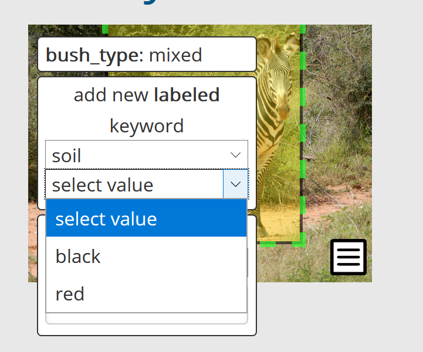

# Encounter

In Wildbook, an Encounter is the foundation of the software. Encounters provide a reference to a time and location where a single animal was seen.

## Navigating to an Encounter Page

To see Encounter information, you must be signed into Wildbook. Once you've signed in, you can use **Search** > **Encounters** to filter encounters or you can use **My Data** > **My Encounters** to see all of the encounters assigned to you.

There are two [data entry methods](data-entry.md) for uploading Encounters: upload a single encounter from the [Report an Encounter](../data/report-encounter.md) page and upload multiple encounters in a [Bulk Import](../data/bulk-import-beta.md).

## Encounter Page Format

The Encounter page has two views: Overview and More Details. The Encounter ID, Encounter workflow state, Contact Information, and Encounter History will persist between views. 

The Encounter workflow state is defined as:

* **Unapproved** - an encounter that has not been reviewed and accepted by a user. This is the default state for encounters submitted using the  [Report an Encounter](../data/report-encounter.md) page.
* **Approved** - an encounter that has been reviewed and accepted by a user. This is the default state for encounters submitted using Bulk Import.
* **Unidentifiable** - an encounter that has been reviewed and determined to be unusable for identification, but should remain in the system. Selecting your state will save it.

For each of the following sections, click the pencil icon to make changes.

If you see fields that are not covered on this page, they are custom to your Wildbook. Contact your administrator or [Wildbook support](https://community.wildme.org/) for any questions about how to use them.

### Date

At minimum, the year must be provided for the encounter to be saved.

#### Encounter Date

The date and time the animal in the photo was seen. Must adhere to ISO format: **YYYY-MM-DD HH:mm**

#### Verbatim Event Date

A free-text field to describe the Encounter Date. This field is searchable, but is not used in finding matches.

### Identity

Identity tells us if an encounter has been identified as a [Marked Individual](../introduction/marked-individual.md).

#### Matched by

Describes how the encounter was identified. The options are:

* **Unmatched first encounter**: No matches were found in the Wildbook, making this a new individual. 
* **Visual Inspection**: Someone compared the pictures between two encounters and determined they are the same individual.
* **Pattern Match**: Wildbook suggested a match candidate and the animal was determined to be the same individual.

#### Individual ID

If the encounter is of an individual that does not exist in the current Wildbook, you should enter a unique ID. This ID needs to be distinct from any Individual ID in your catalog that currently exists. When you've entered the ID, click **Create** to confirm the value and then click **Save**.

If you have determined the encounter is of an existing individual, type the individual ID you want to associate the encounter with. A drop-down menu will display a list of all matching individuals. Select from the list then click **Save**.

To remove an encounter from an individual, click **Unassign Individual**.

#### Alternate ID

If there is an alternative ID used to identify this animal, such as in a historical catalogue, enter it here. Once you've entered the ID, click **Save**.

#### Sighting ID (formerly "Occurrence ID")

Sighting IDs are automatically generated unless they are specified in a Bulk Import. A Sighting is made up of multiple Encounters. You may want to edit the default Sighting ID to more easily sort the encounters that were recorded in a specific place and time. Click **Remove from Sighting** to remove your encounter from the current ID and enter a new one. Click **Create** to confirm the value and then click **Save**.

If you want to add the Encounter to an existing Sighting ID, type the ID and a drop-down menu will display a list of all matching Sightings. Select from the list then click **Save**.

### Metadata

Displays the Encounter ID, the date the Encounter was created in Wildbook, last edited date, whether the encounter was part of a bulk import, and the assigned  user.

#### Assigned user

Use the menu to select from a list of Wildbook users and assign that user as owner of the encounter. Click **Save** to confirm the selection.

### Location

A location ID or coordinates must be set in order to save an Encounter. This information is used to determine match candidates, as well as identify where an Encounter took place.

#### Location

Provide a description of the location where the encounter occurred. Click **Save**. 
* *Note: This field is searchable, but is not used in finding matches. This is valuable if there is a set of landmarks that have multiple names, or if a citizen scientist submits an Encounter and are unsure of exact location.*

#### Location ID

Select from a list of location IDs ("study sites") where the Encounter occurred. Click **Save**. 

* *Note: This list is hierarchical and determined by the administrator of the Wildbook. We recommend no more than 5 hierarchical layers of locations. Reach out to your administrators or to [Wildbook support](https://community.wildme.org/) for configuration assistance)*

#### Country

Select from a list of countries where the Encounter occurred. Click **Save**.

#### GPS Coordinates

Use the map or text fields to enter the GPS coordinates where the encounter occurred in decimal format. Click **Save**. 

### Attributes

Encounters can also have these important attributes.

1. **Taxonomy**: Use the drop-down menu to select from available species. Click **Save**. The Taxonomy affects how Annotations for the Encounter are processed through the [Image Analysis Pipeline](image-analysis-pipeline.md).
2. **Living Status**: Use the drop-down menu to select the animal's living status at the time of the encounter. Click **Save**.
3. **Sex**: Use the drop-down menu to select the animal's sex. Click **Save**.
4. **Distinguishing Scar**: Describes any scarring that could be useful in making a visual comparison between animals. Click **Save**.
5. **Behavior**: Provide a description of the animal's behavior. Click **Save**.
6. **Group Role**: Provide a description of the role the animal has within their group during this Encounter. Click **Save**.
* *Note: If this entry matches the pre-defined behavior list, you can use the search filter for the behavior on Encounter Search page.
7. **Patterning Code**: [TBD]
8. **Life Stage**: Use the drop-down menu to select the life stage for the animal. Click **Save**. Life stage is configured in the commonConfiguration.properties file. [See Configuration for more information.](../specifications-and-system-requirements/system-configuration.md) To update this field, contact Wildbook support for assistance.
9. **Observation comments**: Any information that you want to associate with the encounter. Click **Save**.

### Gallery

The primary purpose of the Gallery is to display the annotations associated with an encounter. This can mean that a media asset is displayed multiple times with different annotations to indicate different detections found.

#### Labeled Keywords

Labelled keywords are provided to allow admins to preset values for users to apply to a MediaAsset. To select a labeled keyword:

1. Click on an image to expand it.
2. Hover on the **add new keyword** button or hover over an existing keyword.
3. Under **add new labeled keyword**, select one of these predefined labels.
4. From the subsequent value dropdown, select the desired value.

Once selected, the keyword appears on the image in the format 'label: value'.


Labeled keywords are set in the [commonConfiguration.properties file](../specifications-and-system-requirements/system-configuration.md); reach out to your admin or to [Wildbook support](https://community.wildme.org) for configuration assistance. [See Configuration for more information.](../specifications-and-system-requirements/system-configuration.md)

#### Keywords

Keywords allow for easy assignment of any string to a MediaAsset.
To select an existing keyword:

1. Click on an image to expand it.
2. Hover on the **add new keyword button** or hover over an existing keyword.
3. Under **add new keyword**, select the desired keyword.

Once selected, the keyword appears on the image.
To add a new keyword:

1. Click on an image to expand it.
2. Hover on the **add new keyword button** or hover over an existing keyword.
3. Under **add new keyword**, type in the text field with the helper text "or enter new". Hit enter to confirm the keyword.

Once entered, the keyword appears on the image.
Keywords are not automatically curated or checked against existing keywords, so you can create duplicate keywords easily. Admins can manage keywords from the **Administer** > **Photo Keywords** menu option.

##### Remove This Image

If an image is low quality or not providing value, select this button to remove the image from the encounter. This does not remove the image from the database and can be reversed.

##### Match Results

After an annotation has run through ID, you can select this button to see the proposed matches for the annotation. This will take to you to the results page, where you will actually perform matching.

##### Start Another Match

If the annotation has no viable matches, or if there have been extension additions to the database, you may want to run the annotation back through the ID process. Select this button to start the process again.

##### Add Annotation

If detection failed to recognize an animal, you can click this option to manually create an Annotation for identification. [More information about manual annotation can be found here.](../data/manual-annotation-beta.md)

##### Add image to Encounter

If there were images that did not get added with the initial upload, you can click this button to browse to the images and upload them to the system. Note that detection is not run on these images automatically. Reach out to Wildbook support for assistance.

### Contact Information

* All information added to the contact information presently references platform users only.
* **Add submitter by email address**, **Add photographer by email address**, and **Add others to notify by email address** all operate in the same manner.
* To add reference to a user in one of these categories, enter their email address and click **Add**.
* To remove reference to a user in one of these categories, click the **Remove** button next to their information.

*(Note: These fields require the email address of a user with an account. The account does not require a name or organization be associated with the account. If you want to recognize users without accounts, use the **Additional Comments** field or use dummy emails in these fields.)*

### Observations

Observations are intended to be short identifiers associated with a given encounter. Observations are searchable, but are not verified or accessible between encounters.

* **To create** an observation, enter a label and value, then click **Set**.
* **To edit** an observation's value, change the text of an existing value, then click **Set** when finished.
* **To delete** an observation, remove the text of an existing value, then click **Set**.

```{note}
Observations can only be edited one at a time.
```

### Measurements

Measurements are used to track numeric information associated with an encounter. These are set in the commonConfiguration.properties file. [See Configuration for more information.](../specifications-and-system-requirements/system-configuration.md) To request measurements be added, [contact Wildbook support for assistance](https://community.wildme.org).
*(Note: You can edit multiple measurements before clicking **Set**.)*

### Tracking

Tracking is used to manage data about tags seen during an encounter.

* **Physical Tag Data**: provides a space for a left or right-side tag to be denoted. Click **Set** after the tag information is entered.
* **Satellite Tag Metadata**: provides information for information associated with tagging done using satellites, including name of satellite, serial number, and Argos PTT. Click **Set** after the tag information is entered.

### Biological Samples

* To enter a biological sample:

1. Click **Add biological sample**.
2. Enter the information you have associated with the sample. The only required information is the **Sample ID**.
3. Click **Set** to finalize the sample and its associated metadata.

* Use the link on the confirmation page to navigate back to the encounter if you want to enter analysis information, including:

1. **Haplotype**
2. **Microsatellite markers**
3. **Genetic sex determination**
4. **Biological/chemical measurement**

* Open the appropriate analysis, then click **Set** to save the information you add.
* Click the **X** button under **Remove** to remove an entire sample.
