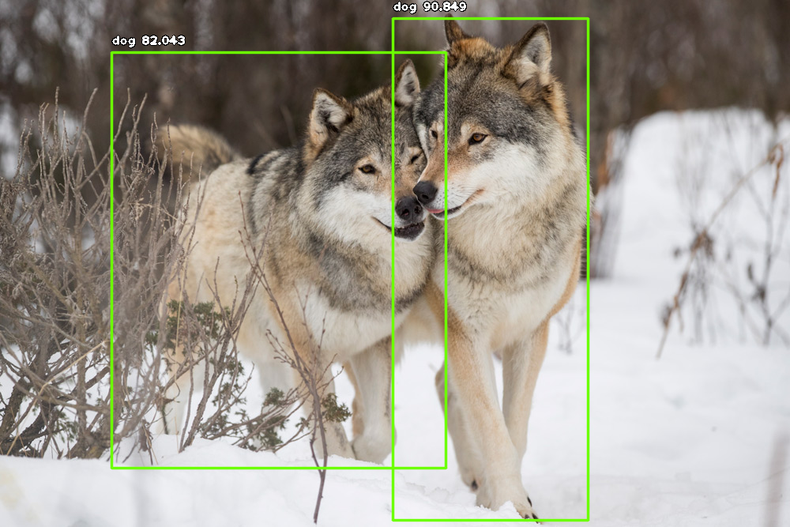
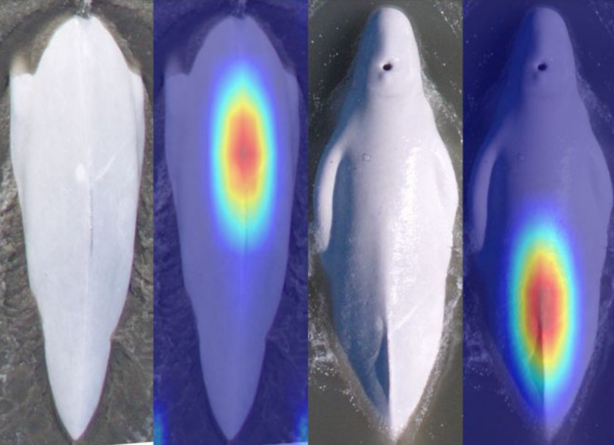
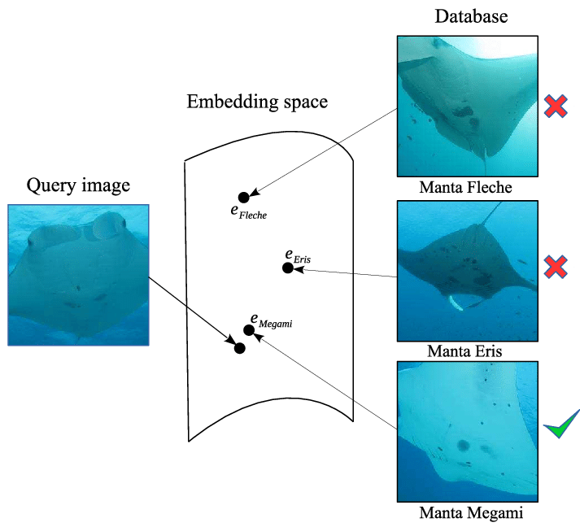
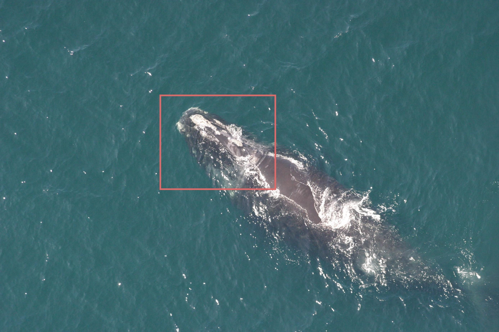
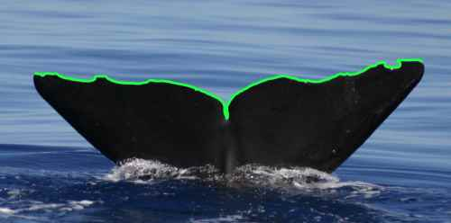
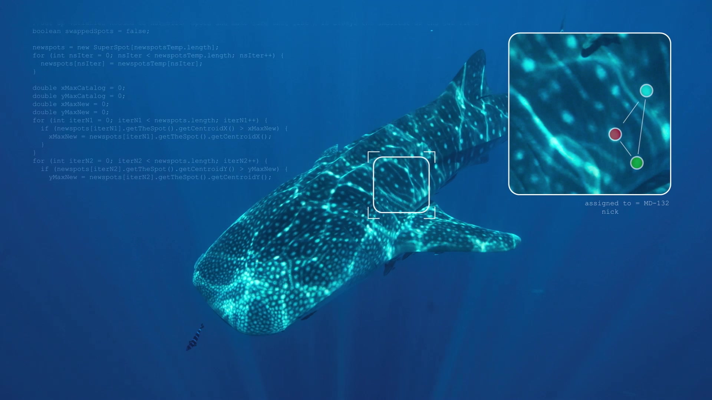

# Image Analysis Pipeline

As technology advances, video and photography equipment are improving in quality, availability, and affordability. Wildlife photography is very popular and there is an abundance of animal images available online. These images have the potential to become critical wildlife data sources. If lots of wildlife images could be easily obtained and combined with metadata (**location**, **date**, and **behavior**), then ecologists could use this information to predict and prevent animal population declines.

Regarding this concept, Wildbook uses a sophisticated machine learning (ML) server called [Wildbook Image Analysis (WBIA)](https://wildbook.docs.wildme.org/introduction/). This server uses a detection pipeline to find animals in photographs. Once an animal has been detected, it is then directed to a specific identification (ID) algorithm that will identify the individual animal. Relying on manual data processing, such as matching photos by eye, can be slow and inaccurate. WIBA focuses on using technology to process data, which improves both speed and precision. This is beneficial for users contributing images to Wildbook. This combination of artificial intelligence and citizen science is vital for discovering new ways to fight extinction.

Here is a link to a [poster presentation](https://cthulhu.dyn.wildme.io/public/posters/parham_wacv_2018.pdf) summarizing some stages of the WBIA’s detection pipeline.

***

## Detection

The detection pipeline is a cascade of deep convolutional neural networks `(DCNNs)`. The combined outcomes of each neural network results in an analyzed image. Based on this information, the image can then be routed to its appropriate ID algorithm. The detection stage involves:

* Finding animals in the image and individually outlining them in bounding boxes called Annotations.
* Identifying and labeling the species on each Annotation.
* Adding viewpoint labels on each Annotation.

There are also optional features that WIBA can provide for each image:

* The background of each Annotation can be removed to get rid of as many non-animal pixels as possible.
* Images can be rotated in order to standardize the angle of the Annotations. This will maximize their comparability in the ID algorithms.
* With some species, such as manta rays and hammerhead sharks, accurately detecting orientation can be difficult. [Orientation networks](https://github.com/WildMeOrg/wbia-plugin-orientation/tree/main/wbia_orientation) are important for detecting the correct rotation, otherwise the precision of downstream processes will be inhibited.
* In addition to the whole animal Annotation, smaller annotations can be added to identify specific parts of an animal (e.g., a fin or a tail).
* The detector can produce a number of Annotations for whole individuals and specific body parts. With some species, such as wild dogs, it can be difficult to tell which tail belongs to which dog. The [Assigner network](https://community.wildme.org/t/the-assigner-building-an-ml-component-start-to-finish/596) analyzes certain features in the photo and assigns a score to the part (tail) and body (dog). A high score reflects high confidence they belong to the same animal.

*Resulting bounding boxes (Annotations) predicted by WBIA's detection pipeline after running a photo of two gray wolves.*

*Resulting bounding boxes (Annotations) predicted by WBIA's detection pipeline after running a photo of three cheetahs.*

***

## Identification

Identification is the next step after detection. It assigns a **Name** (ID) to each **Annotation** (animal) from the detection stage. Different types of detection are used for different species and different body parts. Depending on the type of detection, the Wildbook pipeline directs the Annotation to one or more suitable ID algorithms. It compares the new Annotation to a database. By looking at specific features, it can identify if the Annotation is surrounding an individual we have never seen before, or if they have previously been recorded.

*Visual pipeline showing how different species and body parts are detected, then Wildbook directs them to one or more appropriate algorithms to identify the individual.*

The following ID algorithms are supported by Wildbook:

***

### Matching and Interpreting Embeddings for Wildlife ID (MIEW-ID or µID)

MIEW-ID (µID) is used to identify individuals. MIEW-ID uses deep learning and can learn what makes images similar or dissimilar (or what differentiates one animal from another). Distinguishing individuals through their unique body markings is a key concept for wildlife conservation. However, from the huge database of wildlife images, only a limited number can be used for individual identification, due to constraints on image quality and viewpoint. MIEW-ID can identify individuals from their unique body markings across real world photographic conditions.

MIEW-ID learns embeddings for images from the database. Embeddings are the unique markings that represent individuals. When new images are analyzed, their embeddings are matched against those in the database. As an added benefit, MIEW-ID is able generate visualizations of matched features, providing import inspectability inside its neural network.

*MIEW-ID provides visualization of its matching process, helping researchers review potentially matched features and better confirm suggested ID matches.*

MIEW-ID can be trained on a per-species or multi-species basis and has been successfully cross-applied from data rich to data-deficient species. Currently, Wild Me has generated separate MIEW-ID models for different species including bottlenose dolphins, beluga whales, lions, and more.

***

### Pose Invariant Embeddings (PIE)

**Pose Invariant Embeddings** (PIE) is used to identify individuals. PIE uses a type of machine learning known as deep learning. This means it can learn what makes images similar or dissimilar (or what differentiates one animal from another). Distinguishing individuals through their unique body markings is a key concept for wildlife conservation. However, from the huge database of wildlife images, only a limited number can be used for individual identification, due to constraints on image quality and viewpoint. PIE can identify individuals from their unique body markings, regardless of quality or angles.

PIE learns embeddings for images from the database. Embeddings are the unique markings that represent individuals. When new images are analyzed, their embeddings are matched against those in the database.

PIE can be trained on a per-species basis. Currently, Wild Me has generated separate PIE models for different species including hyenas, leopards, manta rays, humpback whales, right whales, bottlenose dolphins, and orcas.

*New image of a Manta Ray compared against embeddings from the database*.
*A new image of a Manta Ray is identified using the database by finding close points (matches) in the embedding space.*

PIE paper link: https://arxiv.org/pdf/1902.10847.pdf

*Note:* PIE v2 does not currently support analysis of 8-bit black and white images. Images uploaded in this format will not be processed.

***

### Hotspotter

**Hotspotter** analyzes the textures in an image to find distinct patterns, known as ‘hot spots’. It then matches these hot spots against other images in the database. A ranked list of potential matches is produced, and the most likely matches have the highest hot spot similarity.

*The green regions are matching 'hot spots' between the images, matching the query image of a foal to an image of it as a juvenile.*

Hotspotter paper link: http://cs.rpi.edu/hotspotter/crall-hotspotter-wacv-2013.pdf

***

### Deepsense

**Deepsense** is used specifically for identifying right whales. It uses aerial photos that show the varying patterns of callouses on their heads. Deepsense is very fast and accurate, but it needs to be retrained when new, individual whales are added to the catalog. The quality of data is incredibly important as performance reduces with poorly curated catalogs.

*Aerial view of a right whale with an annotation around its head callouses.*

Depsense paper link: https://www.researchgate.net/publication/327910789\_Applying\_deep\_learning\_to\_right\_whale\_photo\_identification

***

### OC/WDTW

**OC/WDTW** (or DTW for short) stands for **‘Digital Time Warping’**. It identifies individual cetaceans from the unique trailing edge of their fins. DTW represents the nicks and notches of flukes and adds them to a database. The trailing edge of a fluke is extracted and compared against potential matches based on their similarities. DTW is robust to changes in viewpoints and poses, as well as being fast and accurate.

*Series of Humpback Whale tail fluke edges being compared to find a match.*

OC/WDTW paper link: https://openaccess.thecvf.com/content\_ICCV\_2017\_workshops/papers/w41/Weideman\_Integral\_Curvature\_Representation\_ICCV\_2017\_paper.pdf

***

### Kaggle7

**Kaggle7** analyzes the unique fluke patterns of humpback whales to identify individuals. It is similar to Deepsense in the fact it must be retrained when new individuals are added to the catalog. Additionally, the catalog must be very well curated for performance to be optimum.

*Fluke patterns of a Humpback Whale's tail.*

Kaggle7 paper link: https://ducha-aiki.medium.com/thanks-radek-7th-place-solution-to-hwi-2019-competition-738624e4c885

***

### Modified Groth and I3S (Spot Pattern Matching)

**Spot pattern matching** or **spot mapping** is a technique used to identify individuals based on their unique, natural spot patterning. Spot patterns are similar to human fingerprints in the fact they are distinctive and individually identifying. The spot pattern of an image is analyzed and compared against others in a database, in order to identify the individual. Both Modified Groth and I3S are algorithms that are used independently of the image analysis pipeline in Wildbook.

*Spot mapping of a Whale Shark's unique body spots.*

Modified Groth paper link: https://besjournals.onlinelibrary.wiley.com/doi/full/10.1111/j.1365-2664.2005.01117.x

I3S paper link: https://www.researchgate.net/publication/228007763\_A\_computer-aided\_program\_for\_pattern-matching\_of\_natural\_marks\_on\_the\_spotted\_raggedtooth\_shark\_Carcharias\_taurus

***

### Consolidated Display

Following both the detection and identification processes, Wildbook displays a list of potential match results. They are organized both per Annotation/feature (e.g., whale fluke) and per algorithm (e.g., PIE). Each image is ranked 1 to 12, from the most to least likely match. Each image also displays what each algorithm found similar between the Annotations, and provides an algorithm-specific score. The higher the score, the higher the likelihood of a match. For example, an image of an Orca dorsal fin would display scores for the algorithms **Kaggle7**, **CurvRank v2**, and **finFindR.**

Each individual also receives their own profile page on Wildbook. It shows where the animal has been, when it was seen, and any relationships they have with other animals.

## FAQ

### Can WBIA detect and label any species?

WBIA is not programmed to detect every single species. Detection relies on pre-trained ML models. Each model is trained for one or more specific species. WBIA provides the tools to create ML models. They must be created prior to using WBIA for species detection in Wildbook.

### What does manual Annotation look like for ML training for a detector for a new species?

Here is a link to an [example training video](https://www.youtube.com/watch?v=qD7LKWQIfeM&amp;feature=youtu.be) for annotation for a new species.

### What happens if detection doesn’t find one or more animals in the photo?

Even machine learning makes mistakes. Users can use [Manual Annotation](https://wildbook.docs.wildme.org/data/manual-annotation-beta/) if detection doesn’t find an animal.

### I am a software developer of ML engineer. How can I learn more about WBIA?

Here is a link to [Wildbook Image Analysis Overview.](https://wildbook.docs.wildme.org/introduction/)