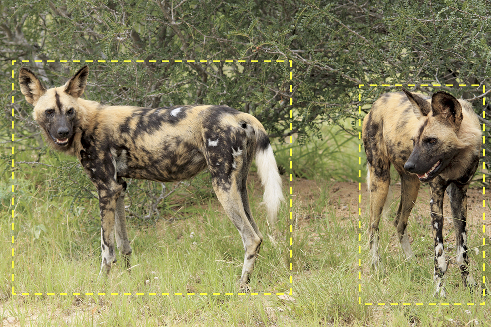

# Sighting

When the system runs the image through Detection, it generates an Annotation for each animal found in the picture. This picture would be returned with two Annotations, like below.



In Wildbook, an Encounter is the foundation component of the software. All entries that a user uploads are encounters. Encounters provide a reference to a *time* and *location* where an animal was spotted.

Because two animals appear at the same time in this picture, we want to ensure that the relationship between these encounters is well understood. Wildbook creates a Sighting, a single instance of a human interacting with one or more animals. This allows researchers to include information about social relationships and observed behaviors. It also helps the system spend resources wisely by acknowledging that two animals observed at the same time in the same place can’t be the same animal.

Unlike Encounters, Sightings are *one-to-many*; each Sighting is one interaction with one or more animals. If you interact with five members of a pack, you have one sighting that is made up of five encounters, one for each animal.

```{note}
Throughout the Wildbook platform, Sightings may also be called Occurrences. We are working to shift terminology for greater user clarity. If you see an instance of outdated language, you can* [post a bug report](https://community.wildme.org/).
```

## Navigating to a Sighting Page

To see Sighting information, you must be signed into the system. Once signed in, you can use *Search* > *Sighting Search* to find Sightings that meet certain criteria. Additionally, there may be a Sighting menu that will allow you to see all Sightings you have access to by clicking View All.

Additionally, you can access a Sighting associated with a specific Encounter; from the [Encounter page](encounter.md), navigating to the Identity section and clicking on the Occurrence ID.

## Sighting Page Format

The Sighting page is headed with the Occurrence ID. Supported character for the Occurrence ID are: latin alphanumeric characters (a-z, A-Z, 0-9), _ and -. Some Wildbooks also include a link to associate a survey with the Sighting.

* **Species:** Displays the species of the animals associated with the Sighting. This is determined by the encounters associated with the sighting and cannot be manually edited.
* **Group Behavior:** Allows for researcher description of the general behavior of the group. Enter the correct information, then click **Set**.
* **Visibility Index:** Allows for researcher input of the visibility in the environment the day the Sighting occurred. Select from the *dropdown*, then click **Set**.
* **Number of Adults Reported:** Displays the number of adults reported as part of the Sighting. This is determined by the Encounters associated with the Sighting if the life stage is available and set. This cannot be manually edited.
* **Number of Marked Individuals Participating:** Displays the number of marked individuals reported as part of the Sighting. This is determined by the Encounters associated with the sighting and cannot be manually edited.
* **Estimated Total Individuals Participating:** Allows for researcher input of the estimated number of Individuals in a Sighting. Enter the correct information, then click **Set**.
* **Location ID:** Displays the Location ID associated with the Sighting. This is determined by the Encounters associated with the Sighting and cannot be manually set.
* **Lat / Long:** The latitude and longitude information associated with the first Encounter data found in a standard import.
* **Bearing / Distance:** The bearing and distance information associated with the Sighting.
* **Encounter Table:** Displays all Encounters associated with the Sighting.
* **Image Gallery:** Displays the images from the Encounters associated with the Sighting.
* **Observations:** Observations are intended to be short identifiers associated with a given Sighting. Observations are searchable, but are not verified or accessible between Sightings.
    * *To create* an observation, enter a *label* and *value*, then click **Set**.
    * *To edit* an observation's value, change the text of an existing value, then click **Set** when finished. *(Note: Observations can only be edited one at a time.)*
    * *To delete* an observation, remove the text of an existing value, then click **Set**.
* **Comments:** An audit trail of the changes that have been made to the Sighting.
