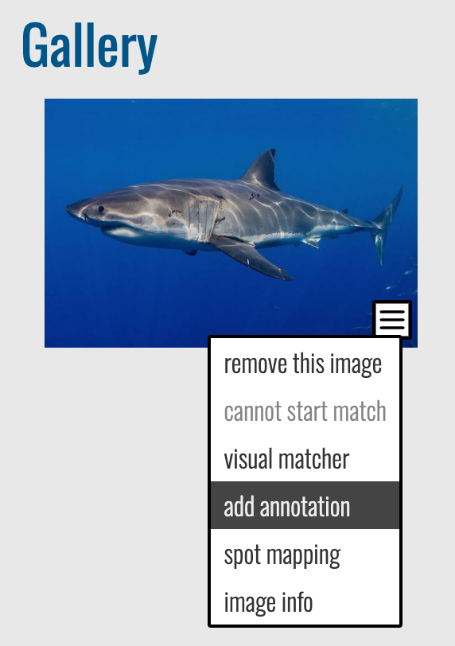

# Manual Annotation (Beta)

When looking at an Encounter page, you may see that a **MediaAsset** does not have a dashed rectangle **(e.g. Annotation bounding box)** around an animal in the picture. In this case, the detection stage did not recognize the animal.

## Navigating to the Manual Annotation Page

In an Encounter page's **Gallery**, open the menu over an image and select **add annotation** to open the manual annotation screen.

$$INFO
title: Info
- Starting in 2020, MantaMatcher users select **create optional feature region** instead. More detailed instructions on manually annotating mantas are on our [YouTube channel](https://www.youtube.com/watch?v=v3T6UwPrCDg).

- Select **spot mapping** if you're annotating whale sharks, grey nurse sharks, or broadnose sevengill sharks in Sharkbook. More detailed instructions on manually annotating whale sharks are on our [YouTube channel](https://www.youtube.com/watch?v=DaHu2K9j4AY).
$$

***

***

## Understanding the Manual Annotation Page

**The Manual Annotation page** has the following sections, which appear in order as you make selections.

***

***

## Creating a Manual Annotation

Each step needs to be completed for the next step to appear on the screen.

Creating a Manual Annotation
Each step needs to be completed for the next step to proceed to the next step.

1. In **Select Viewpoint**, choose the primary viewpoint that the photographer is observing the animal from, such as the animal's **left**, the animal's **right**, looking **down** at the animal, looking **up** at its belly, etc.
2. **Select annotation iaClass** allows you to define the type of animal or feature that represents the annotation. This is a fixed list per species that corresponds to detection classes returned by the[ Image Analysis pipeline](https://docs.wildme.org/product-docs/en/wildbook/introduction/image-analysis-pipeline/).
    * **Animal (ex: turtle\_green, whale\_orca)**: Select all visible parts of the body in one annotation.
    * **Animal+body part (ex: turtle\_green+head, whale\_orca+fin\_dorsal)**: Select only the body part used for identification, such as the head, dorsal fin, fluke, etc.
    * If there are multiple animals in your photo or multiple *iaClasses* you want to annotate, add them later. Only one annotation at a time can be created.
3. In **Draw the new annotation bounding box below**.
    * Hover your mouse over the image, then use the guides to align the corner with the outer edges of the animal.
    * Left-click once to mark the first corner of the bounding box.
    * Release the mouse button and move your mouse pointer to the opposing corner position of a rectangle (i.e. if you start at the top-left of the animal, move your mouse pointer toward the bottom-right). *Note: The dotted-lined box should follow your mouse movements.*
    * Use the guides to align the corner with the outer edges of the animal.
    * Left-click to mark the opposing corner position to complete the annotation.
4. Wait for the screen to refresh.
5. Click **Save** to save your new annotation. A confirmation page will appear with a link back to the Encounter page.

$$INFO
title: Info
When annotating multiple animals in a photo, Wildbook may clone this Encounter and create a new one if another annotation is already on this MediaAsset. Two annotations in one image generally means that two animals are present and at least two Encounters (one animal at a location and date) must exist.
$$

1. Navigate back to the Encounter page and add new annotations if needed, or click [start match](https://docs.wildme.org/product-docs/en/wildbook/data/matching-process/#manually-starting-a-match) to begin the identification pipeline for this new annotation.

***

## Troubleshooting

### How do I fix an annotation?

If an incorrect annotation is created, whether through the detection process or manually, you can first [delete the annotation](https://docs.wildme.org/product-docs/en/wildbook/data/matching-process/#removing-an-annotation) and then re-draw the annotation if desired using the procedures above.

### How do I annotate a part of an individual (Ex. head, tail, etc.)?

When selecting the annotation iaClass, look for the species, plus the part symbol '+'. For example, if you would like to annotate green turtle heads, search 'turtle\_green+head'.

### How do I associate a part with the body in my encounter?

For a new annotation:

1. From the encounter you want to add a part to, select **Add annotation** from the hamburger menu on the correct image.
2. Complete the steps above for adding a new annotation, making sure to select the iaClass that includes the body part.

If the species of the body and the species of the part are the same, the annotations will both be associated with the encounter. If they are not:

1. Delete your newly created part annotation by deleting the new encounter created.
2. Return to your original encounter. Create a new annotation for the body with the correct species.
3. Delete the previous body annotation.
4. Create a new part annotation.