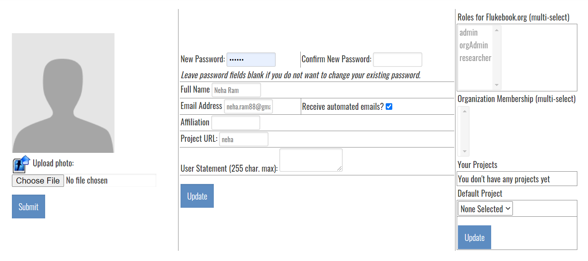
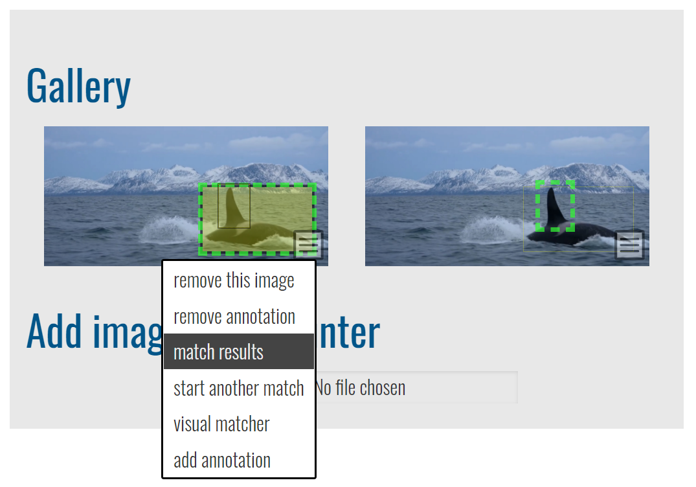
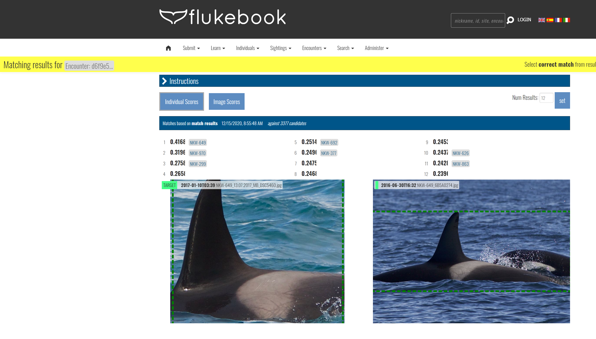
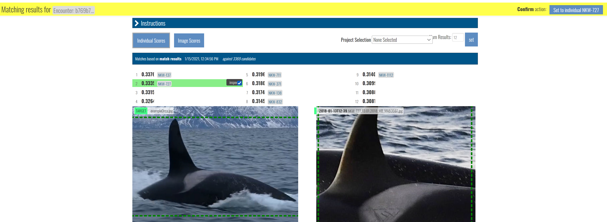
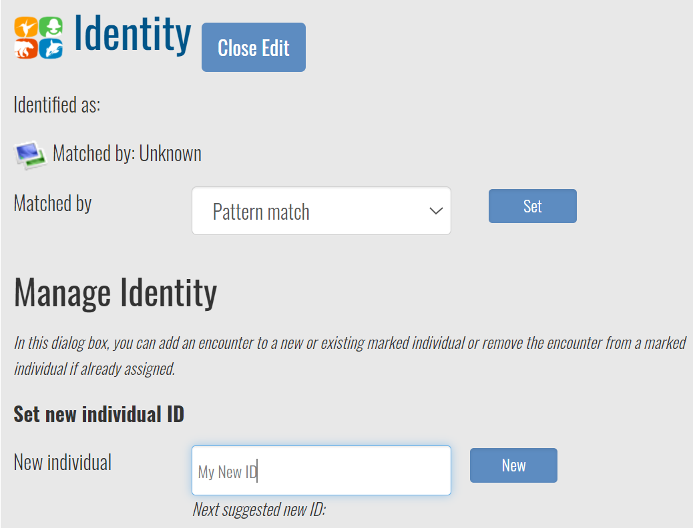

# Getting Started with Wildbook

This Quickstart topic covers some basic tasks and concepts when first logging into Wildbook.

## Account Registration

To set up a Wildbook account, you will need to contact the Wildbook site managers via the **[Contact Us](https://www.wildme.org/contact-us.html)** page. Wildbook does not currently support self-registration. Once you acquire your username and a temporary password from the site managers, you can log in by selecting the **Login** button at the top right corner of the Wildbook program or by accessing any page that requires a user to sign in to access content.

## Change Your Password

After logging in with your given username and password, the first step to do is to change your password. Head to **My Account** under the **Administer** menu and provide your new password in the **New Password** and **Confirm New Password** text boxes.

## Read Up on Basic Wildbook Concepts

The **Introduction** section of the Wildbook documentation provides a good overview of concepts and technologies used in Wildbook. [We suggest starting with the](https://docs.wildme.org/product-docs/en/wildbook/introduction/) **[Overview](https://docs.wildme.org/product-docs/en/wildbook/introduction/)** [page to familiarize yourself with the basics of the platform.](https://docs.wildme.org/product-docs/en/wildbook/introduction/)

## Submit and Match Your First Encounters

A great way to get familiar with the [Wildbook Image Analysis pipeline](https://docs.wildme.org/product-docs/en/wildbook/introduction/image-analysis-pipeline/) is to [report your first Encounter](https://docs.wildme.org/product-docs/en/wildbook/data/report-an-encounter/). Start simple by submitting a single photograph of a single animal for a species supported by the [Wildbook Image Analysis pipeline](https://docs.wildme.org/product-docs/en/wildbook/introduction/image-analysis-pipeline/) to generate an individual ID. If you are unsure which species are available for detection and identification, please consult your Wildbook administrator.

1. Make sure you are logged in to Wildbook. This ensures that any Encounter report is assigned to your account for ownership.
2. From your Wildbook's landing page, select **Report an Encounter** from the **Submit** menu.
3. In the Footage area of the Report an Encounter page, click to import or drag a photo to the gray area and select one photo of one animal for your first Encounter. Wildbook can accept multiple photos of the same animal or even a photo of multiple animals, but to keep this example simple, we suggest you use a photo with only one animal present. For this test example, we will use this Orca photo and submit it to the [Flukebook.org](https://www.flukebook.org) platform for whales and dolphins.
    
4. Once you submit your photo, you must also submit the **Encounter Date**, **Encounter Location**, and **Species** as the minimum required fields. These required fields are indicated by red text, but you can add additional information such as GPS coordinates and elevation in the provided text boxes.
5. Complete the reCaptcha to help prevent spam.
6. Once you have completed your desired data fields, click **Send Encounter Report**. You will then receive a confirmation page confirming your submission.
7. You can click the **View Encounter** link at the bottom of the confirmation page to visit your new Encounter.
    
8. On the righthand side of the Encounter page shown above, green bounding boxes denoting Annotations from [machine learning detection](https://docs.wildme.org/product-docs/en/wildbook/introduction/image-analysis-pipeline/#detection) have appeared: one for the orca body and one for its dorsal fin. If you arrive on this page and you do not see green Annotation boxes, the detection stage may not have been completed yet. It may take a minute or more (depending on how busy the [Wildbook Image Analysis pipeline ](https://docs.wildme.org/product-docs/en/wildbook/introduction/image-analysis-pipeline/#image-analysis-pipeline)is) for the Annotation to appear. *You must refresh the page periodically for these boxes to appear after detection has completed.*
9. After the green bounding boxes have appeared, if they represent a matchable Annotation class in Wildbook, you can click **Match Results** from the menu on the bottom righthand side of the Encounter image to view the ongoing or completed matching process.
    
10. The match results page will show you one set of results for each algorithm run on each Annotation from the submission. In this case, the PIE algorithm as run on the orca body, and the finFindR algorithm was run on the orca dorsal fin.
    
11. Scroll over each potential match (ranked 1-12 from most likely to least likely match) to inspect what each algorithm found similar between the Annotations. Each result includes a rank, an algorithm-specific score, and potentially additional ID and date metadata to help you evaluate the result. See **[Identification](https://docs.wildme.org/product-docs/en/wildbook/introduction/image-analysis-pipeline/#identification)** for more information about each algorithm used in Wildbook.
12. If appropriate, set the ID:
    1. If you find a matched individual in the results, scroll over the matching results and select the Inspect checkbox. A **Set to Individual** button will appear on the right and allow you to set the individual ID for the Encounter you submitted. Congratulations! You made your first match!
        
    2. In this example, this orca did not match any of the proposed match results. This is likely a new individual to the catalog. To set a new ID, return to the Encounter page and click **Edit** in the **Identity** section to **Set New Individual ID**, as shown below. The name you set will become the default name for the individual, but you can set nicknames and alternative IDs later on.
        
13. Congratulations! You have matched or identified your first Marked Individual in Wildbook! Click on the ID in the Encounter page to view the Marked Individual's page and see your submitted Encounter listed.
14. On future logins, you can return to this Encounter from the table displayed when you select **View My Submissions** from the **Encounters** menu.

## Next Steps

The following steps are common after getting started with Wildbook.

### Extend Collaboration Invites

If your Wildbook supports [Silo Security](https://docs.wildme.org/product-docs/en/wildbook/introduction/security-overview/#silo-security), you may want to extend invitations to collaborate to other Wildbook users, allowing view-only or edit-level permissions to your data in Wildbook. See [Silo Security](https://docs.wildme.org/product-docs/en/wildbook/introduction/security-overview/#silo-security) for more information about how to extend collaboration invitations from the **[My Account](https://docs.wildme.org/product-docs/en/wildbook/security/my-account/)** page.

### Request Further Configuration

Wildbook may require further configuration to better suit your research. Common configuration changes that can be made include:

* Adding your project’s[ study sites](https://docs.wildme.org/product-docs/en/wildbook/data/study-sites/) (also known as “location ID” in Wildbook) that represent distinct areas where you conduct your data collection.
* Associating your user account with an organization and/or providing you with [orgAdmin privileges](https://docs.wildme.org/product-docs/en/wildbook/security/silo-security/org-admin/) to allow you to bring additional users into Wildbook for your organization.
* Adding additional species to Wildbook.
* Working with Wild Me to create new machine learning or cross-apply existing techniques for a species.

If these categories apply, please request support on the [Wildbook Community site](https://community.wildme.org) or contact your Wildbook system administrator.

### Bulk Import Legacy Data for Matching

Many researchers have past data that needs importing into Wildbook, such as to:

* Create a base catalog of IDs to match new data against.
* Apply machine learning to existing unprocessed data that needs curation and analysis.

See [Bulk Import](https://docs.wildme.org/product-docs/en/wildbook/data/bulk-import-beta/) for more information on how to convert your data to an Excel-based format for import into Wildbook.